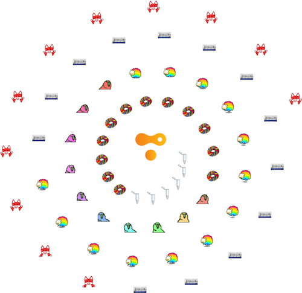
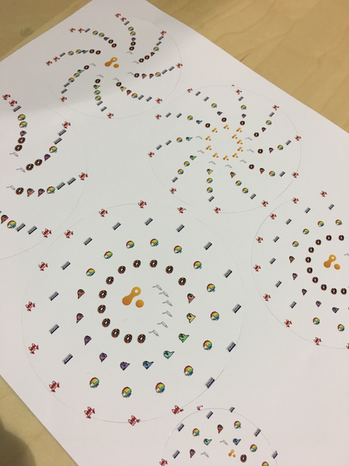
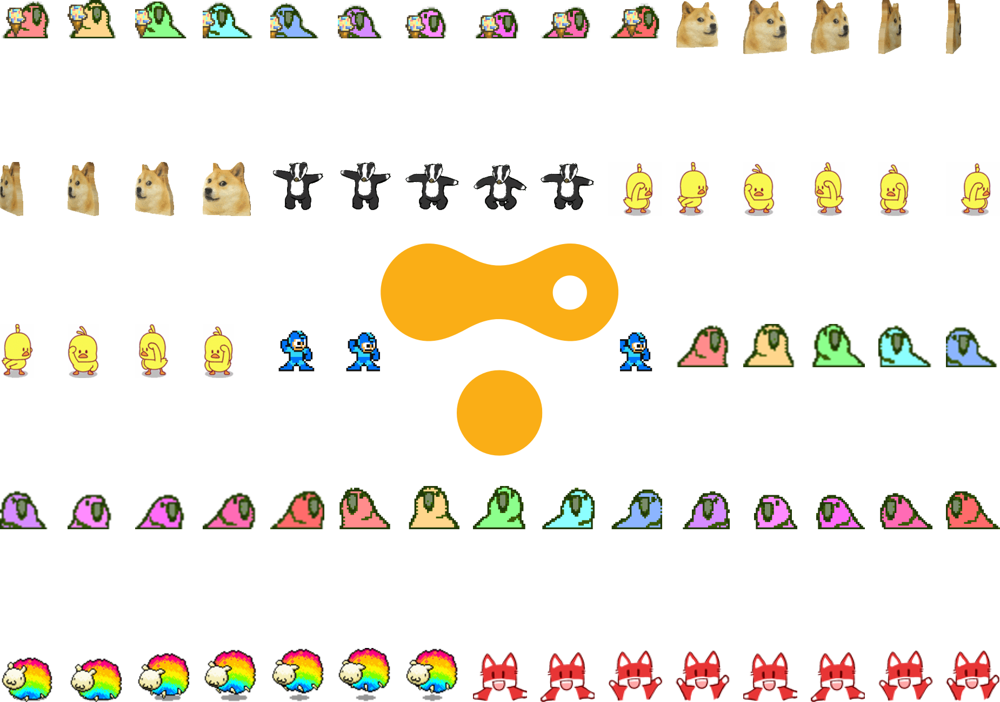
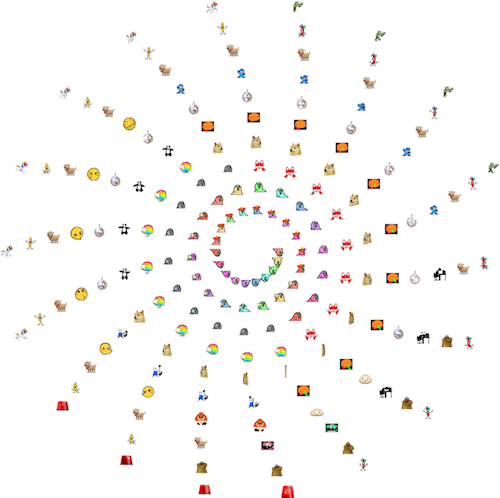
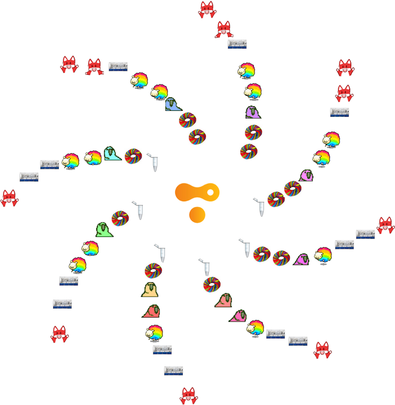

# Take your Slack emojis and make patterns for stickers, mugs, whatever!



Use this repo to download all of the custom emojis for your slack team and transform them into various patterns for SWAG!

## Usage

1. Make sure you have a Slack api token (test is fine)
2. Set that token to an env var called `SLACK_API_TOKEN`
3. Call the `download.js` script from this repo
4. Watch all your little custom slack emojis pile into './generated/'
5. Use the various imagemagick scripts provided to make patterns with your emojis

## Grid
Use './src/grid.sh' to produce a simple N by M grid of emojis.  Great for mugs or t-shirts!

## Spiral
Use './src/spiral.sh' to produce various spiral shapes.  Awesome for circular stickers!

### Some helpful imagemagick commands for generating fun patterns

Center an image within another image and output a composite.  Note that the output doesn't require a file extension.
```
composite -gravity center path/to/image path/to/background path/to/output
```

Convert a gif to a sequence of pngs and scale them all to 100x100 pixels (preserving aspect ratio).  This is helpful if you want to make a pattern out of a few gifs and youw want all the emojis to be of the same size.
Note that the name of the pngs will be something like meme.gif --> [meme-1.png, meme-2.png, ... meme-N.png]
```
convert path/to/meme.gif -scale 100X100 path/to/output/meme.png
```

## Examples

# Stickers



# Grid (done with grid.sh)



# Spiral (done with spiral.sh)



# Star (done with spiral.sh)

